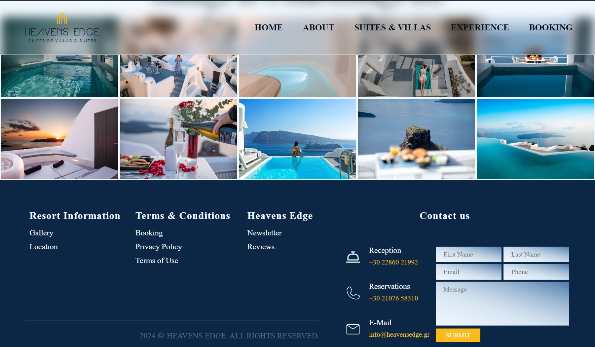
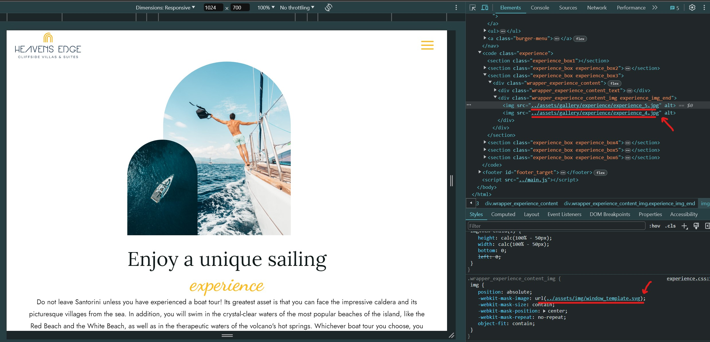
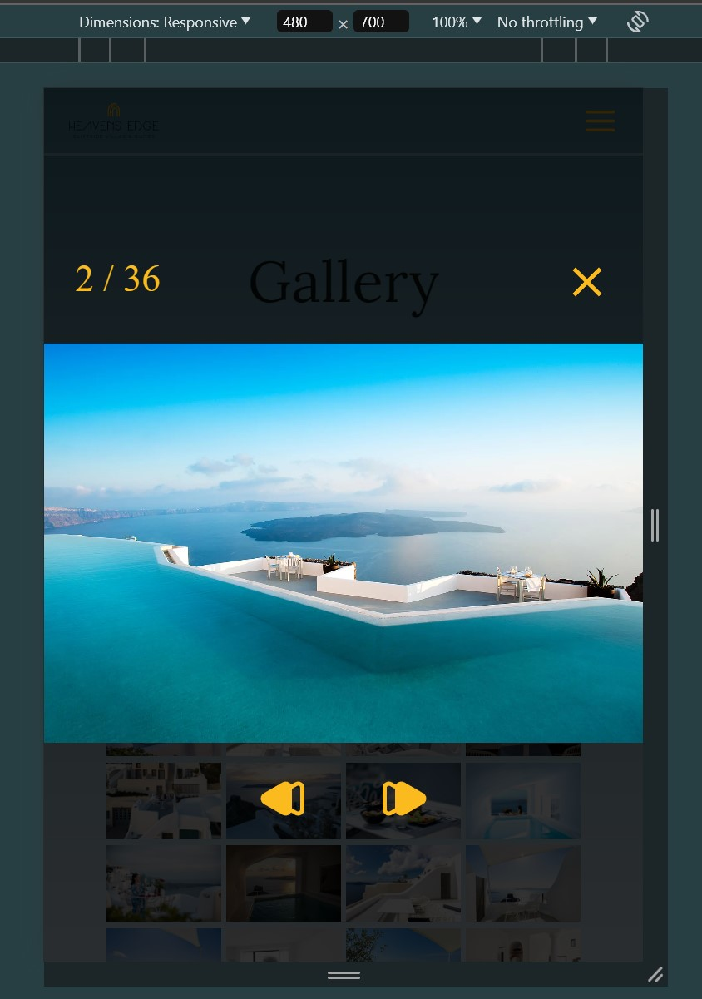
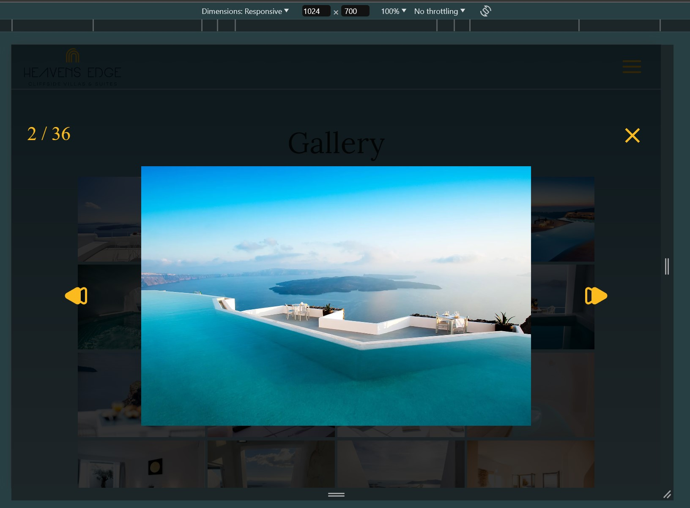
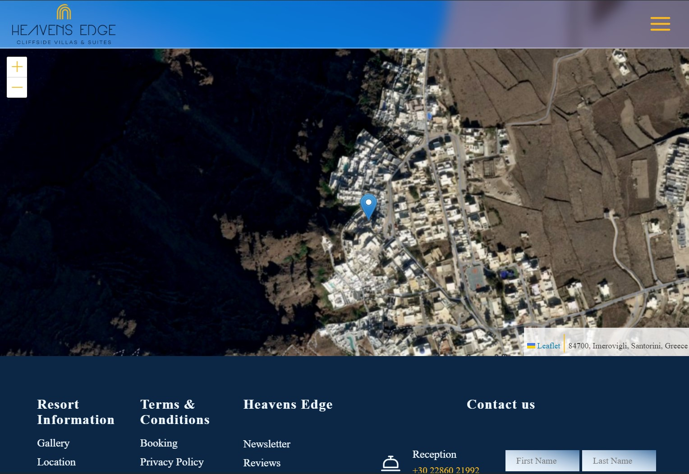

# yqni13 clone (Heavens Edge)
$\texttt{\color{teal}{v1.1.2}}$

## Screenshot navigation options

### Technology 

    
    
    
    Google Fonts
    

 
Official <a href="https://semver.org/">Semantic Versioning Specifications (SemVer)</a> applied to project versioning.

### <a href="https://yqni13.github.io/WEB_HeavensEdge_clone/index.html">TRY LIVE DEMO</a>

 

## MOTIVATION:

To experiment with wallpapers, parallax effects, shaped images, sliders responsive design I decided to clone/redesign a webpage for the greek suite & villa <a href="https://heavensedge.gr">Heavens Edge</a> (original).
  

## HOW TO:

The webpage uses a svg-file to shape displayed images. To do so, the "mask-" properties are necessary to use which is forbidden to use in a browser when loaded by "file://" instead of "http://" thanks to CORS. Therefore, this project needs to be run by server which I personally do by apache server thanks to <a href="https://www.apachefriends.org/index.html">XAMPP</a>. To do this, copy project folder into xampp>htdocs, start xampp control panel, run apache server and navigate in browser to "localhost/foldername/index.html".
  

## SPECIALTIES:

### 1. Images shaped by form of svg via mask- properties

    

 

### 2. Image slideshow to change automatically or can be navigated by dots with timer reset

    

 

### 3. responsive design $\textsf{\color{red}smartphone}$ | $\textsf{\color{lime}tablet}$ & manual image slideshow

    
    

 

### 4. Leaflet maps imported to display location of hotel

    

 

## Updates

[list of all updates](docs/update_protocol.md)
### $\textsf{{\color{pink}{last}} update\ 1.1.1\ >>\ {\color{pink}1.1.2}}$

- $\textsf{\color{red}Bugfix:}$ Map for component 'location' shows satelite picture. [Before: Due to missing api key the map wasn't displayed and error 401 occured.]

 

### Aimed objectives for next $\textsf{\color{green}minor}$ update:
<dl>
    <dd>- scroll hint animation</dd>
    <dd>- error handling for images failing to load</dd>
    <dd>- form submit logic</dd>
    <dd>- additional full page resolution option in gallery slider</dd>
    <dd>- control gallery slider with keys (exit, previous, next)</dd>
</dl>

### Aimed objectives for next $\textsf{\color{cyan}major}$ update:
<dl>
    <dd>- additional component [newsletter]</dd>
    <dd>- additional component [reviews]</dd>
    <dd>- parallax effect</dd>
    <dd>- responsive design > 1440px width</dd>
</dl>

 

## NOTES

### possible GitHub markdown colors (from LaTeX):

 

$\textsf{\color{apricot} APRICOT}$
$\textsf{\color{aquamarine} AQUAMARINE}$
$\textsf{\color{bittersweet} BITTERSWEET}$
$\textsf{\color{black} BLACK}$
$\textsf{\color{blue} BLUE}$
$\textsf{\color{bluegreen} BLUEGREEN}$

$\textsf{\color{blueviolet} BLUEVIOLET}$
$\textsf{\color{brickred} BRICKRED}$
$\textsf{\color{brown} BROWN}$
$\textsf{\color{burntorange} BURNTORANGE}$
$\textsf{\color{cadetblue} CADETBLUE}$
$\textsf{\color{carnationpink} CARNATIONPINK}$

$\textsf{\color{cerulean} CERULEAN}$
$\textsf{\color{cornflowerblue} CORNFLOWERBLUE}$
$\textsf{\color{cyan} CYAN}$
$\textsf{\color{dandelion} DANDELION}$
$\textsf{\color{darkorchid} DARKORCHID}$
$\textsf{\color{emerald} EMERALD}$

$\textsf{\color{forestgreen} FORESTGREEN}$
$\textsf{\color{fuchsia} FUCHSIA}$
$\textsf{\color{goldenrod} GOLDENROD}$
$\textsf{\color{gray} GRAY}$
$\textsf{\color{green} GREEN}$
$\textsf{\color{greenyellow} GREENYELLOW}$

$\textsf{\color{junglegreen} JUNGLEGREEN}$
$\textsf{\color{lavender} LAVENDER}$
$\textsf{\color{limegreen} LIMEGREEN}$
$\textsf{\color{magenta} MAGENTA}$
$\textsf{\color{mahogany} MAHOGANY}$
$\textsf{\color{maroon} MAROON}$

$\textsf{\color{melon} MELON}$
$\textsf{\color{midnightblue} MIDNIGHTBLUE}$
$\textsf{\color{mulberry} MULBERRY}$
$\textsf{\color{navyblue} NAVYBLUE}$
$\textsf{\color{olivegreen} OLIVEGREEN}$
$\textsf{\color{orange} ORANGE}$

$\textsf{\color{orangered} ORANGERED}$
$\textsf{\color{orchid} ORCHID}$
$\textsf{\color{peach} PEACH}$
$\textsf{\color{periwinkle} PERIWINKLE}$
$\textsf{\color{pinegreen} PINEGREEN}$
$\textsf{\color{plum} PLUM}$

$\textsf{\color{processblue} PROCESSBLUE}$
$\textsf{\color{purple} PURPLE}$
$\textsf{\color{rawsienna} RAWSIENNA}$
$\textsf{\color{red} RED}$
$\textsf{\color{redorange} REDORANGE}$
$\textsf{\color{redviolet} REDVIOLET}$

$\textsf{\color{rhodamine} RHODAMINE}$
$\textsf{\color{royalblue} ROYALBLUE}$
$\textsf{\color{royalpurple} ROYALPURPLE}$
$\textsf{\color{rubinered} RUBINERED}$
$\textsf{\color{salmon} SALMON}$
$\textsf{\color{seagreen} SEAGREEN}$

$\textsf{\color{sepia} SEPIA}$
$\textsf{\color{skyblue} SKYBLUE}$
$\textsf{\color{springgreen} SPRINGGREEN}$
$\textsf{\color{tan} TAN}$
$\textsf{\color{tealblue} TEALBLUE}$
$\textsf{\color{thistle} THISTLE}$

$\textsf{\color{turquoise} TURQUOISE}$
$\textsf{\color{violet} VIOLET}$
$\textsf{\color{violetred} VIOLETRED}$
$\textsf{\color{white} WHITE}$
$\textsf{\color{wildstrawberry} WILDSTRAWBERRY}$
$\textsf{\color{yellow} YELLOW}$

$\textsf{\color{yellowgreen} YELLOWGREEN}$
$\textsf{\color{yelloworange} YELLOWORANGE}$

