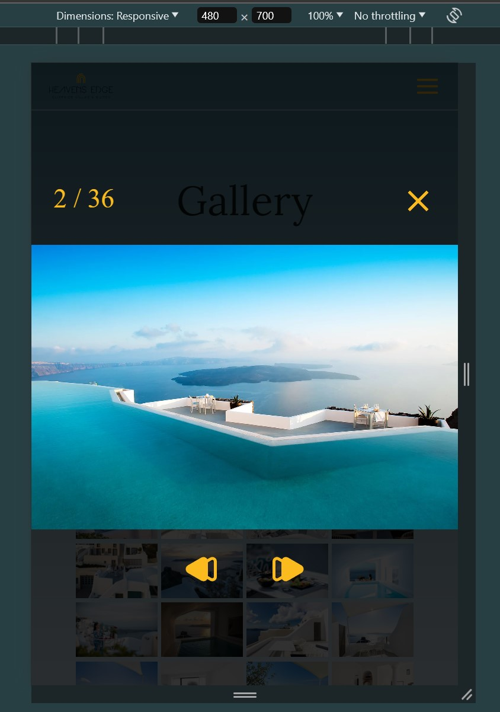

# yqni13 clone (Heavens Edge)
$\texttt{\color{teal}{v1.1.0}}$

## Screenshot navigation options

### Technology 

    
    
    
    Google Fonts
    

 

## MOTIVATION:

To experiment with wallpapers, parallax effects, shaped images, sliders responsive design I decided to clone/redesign a webpage for the greek suite & villa <a href="https://www.heavensedge.gr" target="_blank">Heavens Edge</a>.
  

## HOW TO:

The webpage uses a svg-file to shape displayed images. To do so, the "mask-" properties are necessary to use which is forbidden to use in a browser when loaded by "file://" instead of "http://" thanks to CORS. Therefore, this project needs to be run by server which I personally do by apache server thanks to <a href="https://www.apachefriends.org/index.html" target="_blank">XAMPP</a>. To do this, copy project folder into xampp>htdocs, start xampp control panel, run apache server and navigate in browser to "localhost/foldername/index.html".
  

## SPECIALTIES:

### 1. Images shaped by form of svg via mask- properties

    

 

### 2. Image slideshow to change automatically or can be navigated by dots with timer reset

    

 

### 3. responsive design $\textsf{\color{red}smartphone}$ | $\textsf{\color{lime}tablet}$ & manual image slideshow

    
    

 

### 4. Leaflet maps imported to display location of hotel

    

 

## Updates

### $\textsf{last\ update\ 1.0.0\ >>\ {\color{pink}1.1.0}}$

- $\textsf{\color{orange}Change:}$ The double window-shaped pictures displayed at the experience component were shrunken to fit the resolution better.
- $\textsf{\color{orange}Change:}$ The logo displayed inside the collapsed navigation bar for mobile devices were shrunken due to unfitting resolution.

### Aimed objectives for next $\textsf{\color{green}minor}$ update:
<dl>
    <dd>- scroll hint animation</dd>
    <dd>- error handling for images failing to load</dd>
    <dd>- form submit logic</dd>
    <dd>- additional full page resolution option in gallery slider</dd>
</dl>
 

### Aimed objectives for next $\textsf{\color{cyan}major}$ update:
<dl>
    <dd>- additional component [newsletter]</dd>
    <dd>- additional component [reviews]</dd>
    <dd>- parallax effect</dd>
    <dd>- responsive design > 1440px width</dd>
</dl>
